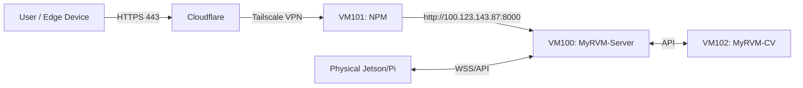

# Network Topology & Identity Map

**Updated:** 2026-01-27

## 🖥️ Server Infrastructure (Proxmox Cluster)

| IP Address | Hostname | VM ID | Role | Details |
| :--- | :--- | :--- | :--- | :--- |
| **100.109.155.120** | `pve` | - | **Proxmox Host** | Hypervisor managing VMs |
| **100.123.143.87** | `vm100` | 100 | **Docker Host** | Runs `MyRVM-Server`, `Redis`, `Postgres` |
| **100.126.171.102** | `vm101` | 101 | **Nginx Proxy** | Reverse Proxy Manager (NPM) |
| **100.98.142.94** | `vm102` | 102 | **CV Host** | Dedicated AI Inference Server (YOLO) |

## 🤖 Edge Devices (Physical / IoT)

> **Note:** Edge devices are physical nodes (Jetson Orin / Raspberry Pi), not VMs.

| IP Address | Device Name | Hardware | Role |
| :--- | :--- | :--- | :--- |
| **100.117.234.2** | `orin1` | **Jetson Orin** | **Primary Edge Node** (Dev/Test) |
| *Dynamic* | *varies* | **Raspberry Pi** | *Secondary/Alternative Edge Node* |

## 🔑 SSH Access Credentials

| Target | Command | Password |
| :--- | :--- | :--- |
| **MyRVM-Server** | `ssh my@100.123.143.87` | `f3rifeb` |
| **MyRVM-Edge** | `ssh my@100.117.234.2` | `f3rifeb` |

## 🌐 Domain & Routing Flow

**Domain:** `https://myrvm.penelitian.my.id/`

## 🛠️ Deployment Notes
- **Server:** Docker Compose (Laravel, Redis, Postgres).
- **Edge:** Native Python (Systemd Service). **NO DOCKER** (Clean Setup).
- **Compatibility:** **ARM64** is the target architecture for all Edge deployments.

## 🔄 Git Workflow Protocol (STRICT)

1.  **Orin Synchronization:**
    - SEBELUM melakukan ujicoba di Edge Device: **SSH Remote** -> **`git pull origin master`**.
    - Pastikan berada di branch `master` untuk eksekusi/runtime (Status: Clean).

2.  **Agent Pushes:**
    - Jika ada perubahan kode atau perintah push: **Wajib Push ke branch `RVMServer`** (Branch khusus Antigravity/Agent).
    - JANGAN push langsung ke `master` kecuali atas perintah eksplisit untuk sinkronisasi final.