# Artifact: MyRVM Ecosystem Overview
**Date:** 2026-01-17
**Revision Sequence:** -
**Reference Change:** -
**Context:** Architecture overview and visual diagrams for the MyRVM Recycling Economy Platform

---

## 1. Summary

**MyRVM** adalah **Platform Ekonomi Daur Ulang (Recycling Economy Platform)** yang mengelola Reverse Vending Machine (RVM) dengan Computer Vision berbasis AI. Sistem ini menggabungkan:

- **Edge Computing** (Jetson Orin Nano) untuk inferensi AI real-time
- **Cloud Services** (Laravel 12) untuk manajemen data dan ekonomi
- **GPU Computing** (Stateless CV Server) untuk training model
- **Multi-tenant Architecture** dengan sistem rewards (Poin, Voucher, Stablecoin)

---

## 2. User Journey Diagram

```mermaid
flowchart LR
    subgraph Input["📱 User"]
        A["Scan QR Code"]
    end
    subgraph Process["🔄 RVM Machine"]
        B["Deposit Bottle"]
        C["AI Detection"]
    end
    subgraph Output["💰 Rewards"]
        D["Get Points"]
        E["Redeem Voucher"]
    end
    A --> B --> C --> D --> E
    style A fill:#F7F7F4,stroke:#D4D4D0
    style B fill:#EAEBE7,stroke:#C9C9C5
    style C fill:#EAEBE7,stroke:#C9C9C5
    style D fill:#FEF0ED,stroke:#F34F1D
    style E fill:#FEF0ED,stroke:#F34F1D
```

---

## 3. Architecture Diagram

---

## 4. System Components

```mermaid
flowchart TB
    subgraph Server["☁️ vm100 - RVM-Server"]
        L["Laravel 12"]
        PG["PostgreSQL"]
        R["Redis"]
        M["MinIO"]
    end
    
    subgraph Edge["🔧 RVM-Edge (Jetson)"]
        AI["YOLO11 + SAM2"]
        HW["Motors/Sensors"]
        LCD["Touchscreen"]
    end
    
    subgraph CV["🎯 vm102 - RVM-CV"]
        GPU["GPU Computing"]
        T["Model Training"]
    end
    
    subgraph Apps["📱 Mobile Apps"]
        UA["User App"]
        TA["Tenant App"]
        TEC["Technician App"]
    end
    
    Edge <-->|"Tailscale VPN"| Server
    CV <-->|"Tailscale VPN"| Server
    Apps <-->|"REST API"| Server
```

---

## 5. Key Decisions / Logic

| Component | Tech Stack | Function |
|-----------|-----------|----------|
| **RVM-Server** | Laravel 12, PostgreSQL, Redis, MinIO | Central hub, API, storage, dashboard |
| **RVM-Edge** | Python, PyTorch, Jetson Orin Nano | Edge AI inference, hardware control |
| **RVM-CV** | FastAPI, PyTorch, CUDA | GPU training, stateless compute |
| **Mobile Apps** | Flutter | User/Tenant/Technician interfaces |

---

## 6. Network Configuration

| Node | Tailscale IP | Role |
|------|-------------|------|
| vm100 (Docker Host) | `100.123.143.87` | Server + Storage |
| vm102 (CV Machine) | `100.98.142.94` | Pure GPU Computing |
| RVM-Edge (Jetson) | `100.117.234.2` | Edge AI Processing |

---

## 7. Current Status

✅ **MyRVM-Server Running**
- URL: `http://100.123.143.87:8080`
- Containers: myrvm-web, myrvm-app, myrvm-db, myrvm-redis
- Database: 31 migrations applied
- Landing Page: Active

---

## 8. Revision History Log

| Date | Rev | Change Notes |
|:-----|:----|:-------------|
| 2026-01-17 | - | Initial architecture overview with Mermaid diagrams |
