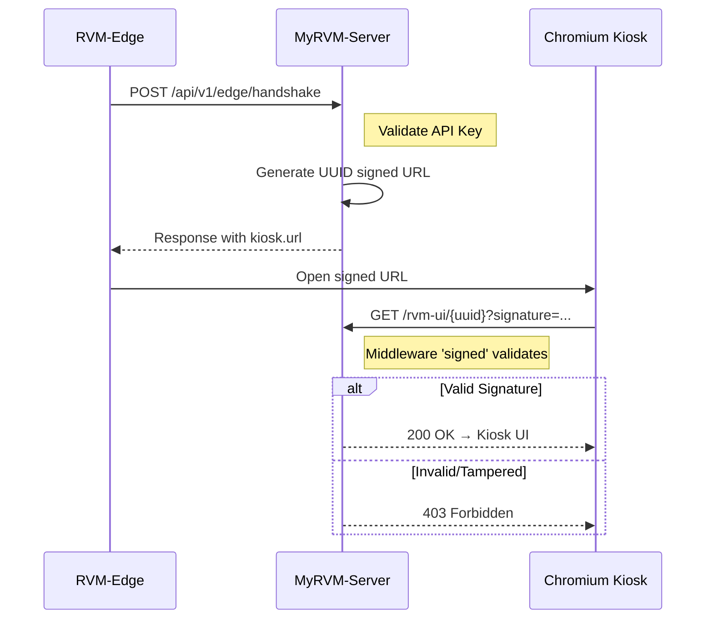

# Walkthrough: Kiosk URL Security Implementation

**Date:** 2026-01-26
**Module:** RVM-UI Kiosk Security (Signed URL)

---

## Summary

Implementasi keamanan URL Kiosk menggunakan Signed URL dengan UUID (36-char format) untuk memastikan hanya browser pada mesin RVM yang valid dapat mengakses antarmuka Kiosk.

---

## Changes Made

### Database

| File | Description |
|------|-------------|
| [Migration](file:///home/my/MyRVM1/MyRVM-Server/database/migrations/2026_01_26_104100_add_uuid_to_rvm_machines.php) | Added `uuid` column to `rvm_machines` |

### Models

| File | Changes |
|------|---------|
| [RvmMachine.php](file:///home/my/MyRVM1/MyRVM-Server/app/Models/RvmMachine.php) | Added `uuid` to fillable, casts, auto-generate on creation |

### Routes

| File | Changes |
|------|---------|
| [web.php](file:///home/my/MyRVM1/MyRVM-Server/routes/web.php) | `/rvm-ui/{uuid}` + middleware `signed` |

### Controllers

| File | Changes |
|------|---------|
| [EdgeDeviceController.php](file:///home/my/MyRVM1/MyRVM-Server/app/Http/Controllers/Api/EdgeDeviceController.php) | `generateSignedKioskUrl()` uses `URL::signedRoute()`, response uses `uuid` |
| [KioskController.php](file:///home/my/MyRVM1/MyRVM-Server/app/Http/Controllers/Dashboard/KioskController.php) | Lookup by `uuid` instead of `serial_number` |
| [AuthController.php](file:///home/my/MyRVM1/MyRVM-Server/app/Http/Controllers/Api/Kiosk/AuthController.php) | Fixed `access_pin` comparison, uses `technician` relation |

### API Documentation

| File | Changes |
|------|---------|
| [api-docs.json](file:///home/my/MyRVM1/MyRVM-Server/storage/api-docs/api-docs.json) | Updated handshake response examples with UUID format |

---

## URL Format

**Before:** `/rvm-ui/RVM-202601-006?signature=xxx` (custom signature)

**After:** `/rvm-ui/550e8400-e29b-41d4-a716-446655440000?signature=...` (Laravel signed)

---

## Security Flow

---

## Verification

✅ Migration ran successfully
✅ UUID column added to existing machines
✅ Signed URL generation working
✅ Route protected by `signed` middleware
✅ API docs updated
