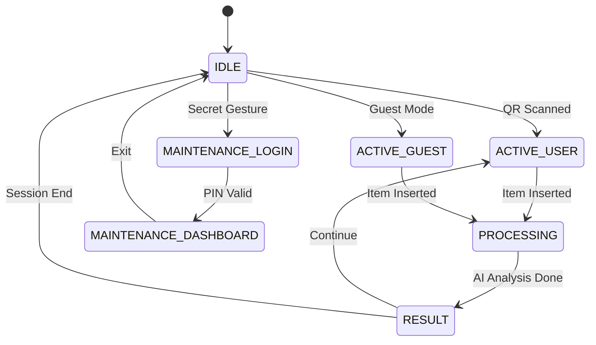

# Implementation Plan: RVM-UI Kiosk Interface Module

**Version:** 1.0
**Date:** 2026-01-25
**Target Repository:** MyRVM-Server (Laravel 12)
**Target Environment:** Chromium Browser (Kiosk Mode) pada Jetson Orin Nano

---

## Executive Summary

Modul **RVM-UI Kiosk** adalah antarmuka frontend khusus untuk layar sentuh mesin RVM. Modul ini disajikan oleh Laravel (server-side rendering dengan Blade) dan interaktif dengan Vue.js 3. UI ini dirancang untuk **touch-first interaction** tanpa elemen navigasi browser, dan reaktif terhadap event WebSocket.

> [!IMPORTANT]
> **Design Philosophy:** Bio-Digital Minimalism (Matte, High Contrast, Fluid Animations) sesuai dengan perancangan-pendekatan-bio-digital.md

---

## Proposed Changes

### Backend Controllers

#### [NEW] [KioskController.php](file:///home/my/MyRVM1/MyRVM-Server/app/Http/Controllers/Dashboard/KioskController.php)
Web controller untuk rendering halaman kiosk utama. Validasi `machine_uuid`, inject konfigurasi mesin, render Blade view.

#### [NEW] Kiosk API Controllers (Folder `Api/Kiosk/`)

| File | Fungsi |
|------|--------|
| `SessionController.php` | Generate token sesi, aktivasi mode tamu |
| `AuthController.php` | Validasi PIN teknisi untuk maintenance |
| `MaintenanceController.php` | Kirim command hardware ke Edge |
| `LogController.php` | Log viewer (scoped by machine_id) |
| `ConfigController.php` | Update tema/konfigurasi kiosk |

---

### Routes Configuration

#### [MODIFY] [web.php](file:///home/my/MyRVM1/MyRVM-Server/routes/web.php)
Menambahkan route `/rvm-ui/{machine_uuid}` untuk halaman kiosk.

```php
// RVM-UI Kiosk Interface
Route::get('/rvm-ui/{machine_uuid}', [KioskController::class, 'index'])
    ->name('kiosk.index');
```

#### [MODIFY] [api.php](file:///home/my/MyRVM1/MyRVM-Server/routes/api.php)
Menambahkan group route `/api/v1/kiosk/*`:

```php
// Kiosk API Routes (Machine Authentication)
Route::prefix('v1/kiosk')->group(function () {
    Route::get('/session/token', [Kiosk\SessionController::class, 'getToken']);
    Route::post('/session/guest', [Kiosk\SessionController::class, 'activateGuest']);
    Route::post('/auth/pin', [Kiosk\AuthController::class, 'verifyPin']);
    Route::post('/maintenance/command', [Kiosk\MaintenanceController::class, 'sendCommand']);
    Route::get('/logs', [Kiosk\LogController::class, 'index']);
    Route::post('/config/theme', [Kiosk\ConfigController::class, 'updateTheme']);
});
```

---

### Middleware & Security

#### [NEW] [ValidateKioskMachine.php](file:///home/my/MyRVM1/MyRVM-Server/app/Http/Middleware/ValidateKioskMachine.php)
Middleware untuk validasi bahwa request berasal dari mesin RVM yang valid:
- Validasi `machine_uuid` terdaftar
- Validasi IP whitelist (opsional)
- Inject `machine_id` ke request

---

### Event Broadcasting

#### [NEW] Folder `app/Events/Kiosk/`

| File | Fungsi |
|------|--------|
| `HardwareCommandEvent.php` | Event untuk command ke Python Daemon |
| `UiUpdateEvent.php` | Event untuk update tampilan kiosk |
| `SessionAuthorizedEvent.php` | Event saat user scan QR berhasil |
| `ItemProcessedEvent.php` | Event saat item (botol) diproses |

---

### Frontend Structure

#### [NEW] Blade Views (`resources/views/dashboard/kiosk/`)

| File | Deskripsi |
|------|-----------|
| `layout.blade.php` | HTML Skeleton tanpa navbar/sidebar |
| `index.blade.php` | Vue.js mount point |

#### [NEW] CSS (`resources/css/kiosk.css`)
Styling khusus kiosk dengan:
- Bio-Digital color palette (Light & Dark mode)
- Touch-optimized sizing (min 44x44px)
- Fluid animations
- Custom theme variables

#### [NEW] Vue.js Application (`resources/js/kiosk/`)

```
resources/js/kiosk/
├── app.js                  # Entry Point
├── stores/
│   ├── kioskStore.js       # Main state (screen, session, user)
│   └── themeStore.js       # Theme management (Light/Dark/Auto)
└── components/
    ├── IdleScreen.vue      # QR Code Display
    ├── ActiveSession.vue   # User session info
    ├── ProcessingScreen.vue # AI analysis animation
    ├── ResultScreen.vue    # Accept/Reject popup
    ├── PinPad.vue          # Maintenance login
    ├── MaintenancePanel.vue # Control panel
    └── LogViewer.vue       # Machine logs viewer
```

---

### Vite Configuration

#### [MODIFY] [vite.config.js](file:///home/my/MyRVM1/MyRVM-Server/vite.config.js)
Menambahkan entry point terpisah untuk kiosk:

```diff
 input: [
     'resources/css/app.css',
     'resources/js/app.js',
+    'resources/css/kiosk.css',
+    'resources/js/kiosk/app.js',
 ],
```

---

### Package Dependencies

#### [MODIFY] [package.json](file:///home/my/MyRVM1/MyRVM-Server/package.json)
Menambahkan dependencies untuk Vue.js 3:

```json
{
    "dependencies": {
        "vue": "^3.5.0",
        "pinia": "^3.0.0",
        "qrcode.vue": "^3.0.0",
        "laravel-echo": "^2.0.0",
        "pusher-js": "^8.0.0"
    }
}
```

---

## UI/UX Color Palette (Bio-Digital)

### Light Mode
| Variable | Hex | Deskripsi |
|----------|-----|-----------|
| `--bg-primary` | `#FDFDFD` | Putih Alami |
| `--bg-secondary` | `#EEEEEE` | Abu-abu Terang |
| `--text-primary` | `#404040` | Abu-abu Arang |
| `--text-secondary` | `#9E9E9E` | Abu-abu Sedang |
| `--accent-primary` | `#4CAF50` | Hijau Alam |
| `--accent-warning` | `#FFB74D` | Oranye Lembut |

### Dark Mode
| Variable | Hex | Deskripsi |
|----------|-----|-----------|
| `--bg-primary` | `#1A1A1A` | Deep Charcoal |
| `--bg-secondary` | `#2D2D2D` | Charcoal Terang |
| `--text-primary` | `#E0E0E0` | Soft White |
| `--text-secondary` | `#9E9E9E` | Abu-abu Sedang |
| `--accent-primary` | `#66BB6A` | Hijau Alam (Brighter) |
| `--accent-warning` | `#FFB74D` | Oranye Lembut |

---

## Screen States Flow



---

## Security Checklist

- [x] **SQL Injection:** Using Eloquent ORM with parameterized queries
- [x] **PIN Storage:** PIN akan di-hash dengan bcrypt
- [x] **Machine Validation:** Middleware validasi UUID mesin
- [x] **Log Isolation:** Query log di-filter by `machine_uuid`
- [x] **CSRF:** Token CSRF untuk form submissions
- [x] **Rate Limiting:** Throttle pada endpoint PIN verification

---

## Verification Plan

### Automated Tests
```bash
# Run PHPUnit tests for Kiosk controllers
php artisan test --filter=KioskTest

# Run Vite build
npm run build

# Test WebSocket connection
php artisan reverb:start
```

### Manual Verification
1. Access `/rvm-ui/{valid-machine_uuid}` - should show Idle screen with QR
2. Access `/rvm-ui/invalid-machine_uuid` - should show error page
3. Test PIN pad - should validate against technician assignments
4. Test theme toggle - should switch between Light/Dark/Auto
5. Test WebSocket - send event from server, verify UI updates

---

## Implementation Roadmap

| Phase | Description | Estimated |
|-------|-------------|-----------|
| 1 | Backend Routes & Controllers | 40% |
| 2 | Frontend Foundation (Blade + CSS) | 15% |
| 3 | Vue Components Development | 25% |
| 4 | Real-time Integration | 10% |
| 5 | Polish & UX | 5% |
| 6 | API Documentation Update | 5% |

---

## Rollback Plan

Jika implementasi gagal:
1. **Routes:** Hapus route dari `web.php` dan `api.php`
2. **Controllers:** Hapus folder `Api/Kiosk/` dan `KioskController.php`
3. **Views:** Hapus folder `resources/views/dashboard/kiosk/`
4. **Assets:** Revert `vite.config.js` dan hapus file CSS/JS kiosk
5. **Dependencies:** Revert `package.json` dan run `npm install`
