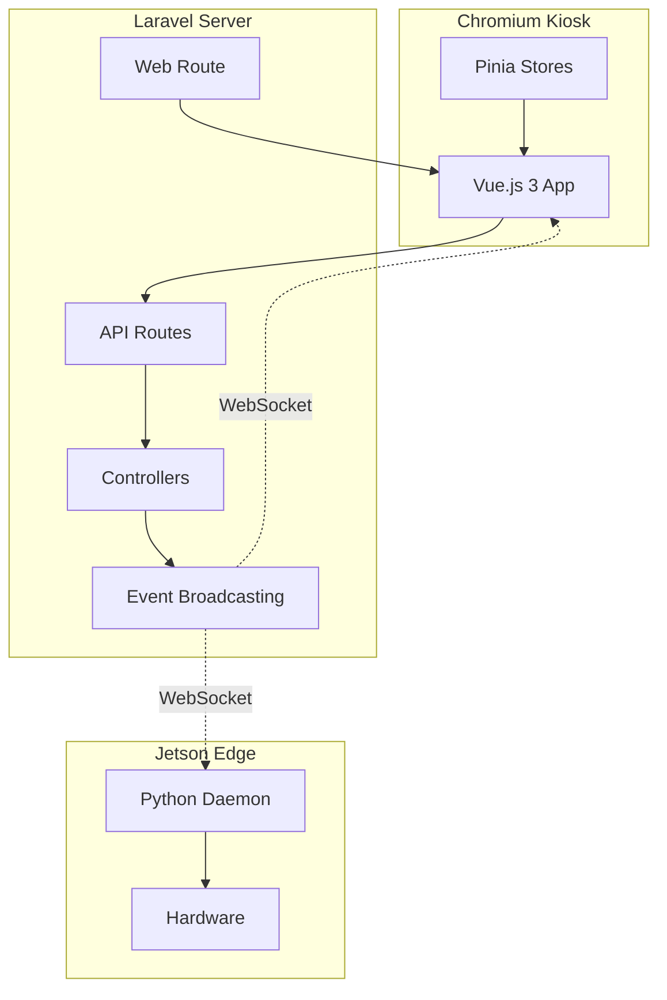
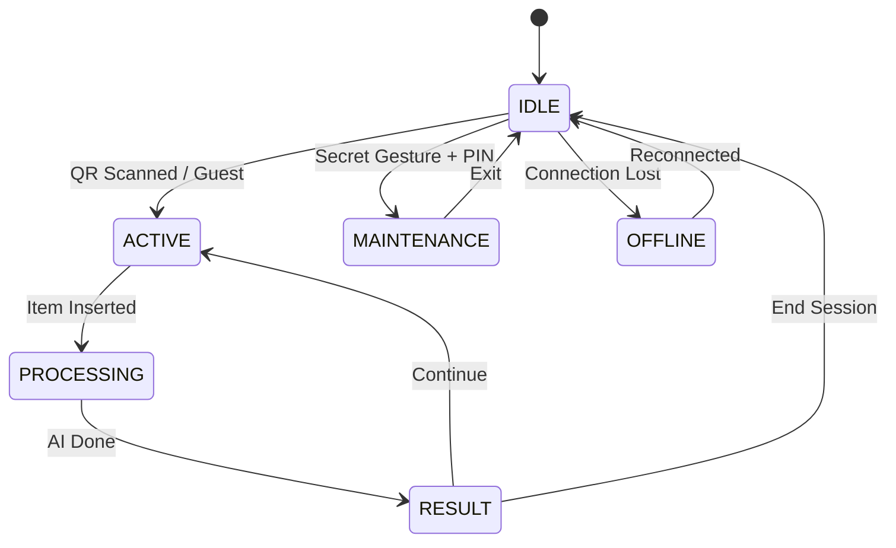

# Walkthrough: RVM-UI Kiosk Interface Module

**Date:** 2026-01-25
**Module:** RVM-UI Kiosk (Touchscreen Interface)
**Target:** MyRVM-Server (Laravel 12)

---

## Summary

Modul RVM-UI Kiosk telah berhasil diimplementasikan. Modul ini menyediakan antarmuka touchscreen untuk mesin RVM yang berjalan di Chromium Kiosk Mode pada Jetson Orin Nano.

---

## Files Created

### Backend Controllers (6 files)

| File | Path |
|------|------|
| [KioskController.php](file:///home/my/MyRVM1/MyRVM-Server/app/Http/Controllers/Dashboard/KioskController.php) | Web controller, render kiosk |
| [SessionController.php](file:///home/my/MyRVM1/MyRVM-Server/app/Http/Controllers/Api/Kiosk/SessionController.php) | QR token & guest mode |
| [AuthController.php](file:///home/my/MyRVM1/MyRVM-Server/app/Http/Controllers/Api/Kiosk/AuthController.php) | PIN authentication |
| [MaintenanceController.php](file:///home/my/MyRVM1/MyRVM-Server/app/Http/Controllers/Api/Kiosk/MaintenanceController.php) | Hardware commands |
| [LogController.php](file:///home/my/MyRVM1/MyRVM-Server/app/Http/Controllers/Api/Kiosk/LogController.php) | Machine logs viewer |
| [ConfigController.php](file:///home/my/MyRVM1/MyRVM-Server/app/Http/Controllers/Api/Kiosk/ConfigController.php) | Theme settings |

### Middleware (1 file)

| File | Path |
|------|------|
| [ValidateKioskMachine.php](file:///home/my/MyRVM1/MyRVM-Server/app/Http/Middleware/ValidateKioskMachine.php) | Machine UUID validation |

### Event Classes (4 files)

| File | Path |
|------|------|
| [HardwareCommandEvent.php](file:///home/my/MyRVM1/MyRVM-Server/app/Events/Kiosk/HardwareCommandEvent.php) | Commands to Edge |
| [UiUpdateEvent.php](file:///home/my/MyRVM1/MyRVM-Server/app/Events/Kiosk/UiUpdateEvent.php) | UI state changes |
| [SessionAuthorizedEvent.php](file:///home/my/MyRVM1/MyRVM-Server/app/Events/Kiosk/SessionAuthorizedEvent.php) | QR scan success |
| [ItemProcessedEvent.php](file:///home/my/MyRVM1/MyRVM-Server/app/Events/Kiosk/ItemProcessedEvent.php) | AI classification result |

### Frontend Files (11 files)

| File | Path |
|------|------|
| [index.blade.php](file:///home/my/MyRVM1/MyRVM-Server/resources/views/dashboard/kiosk/index.blade.php) | Main HTML skeleton |
| [kiosk.css](file:///home/my/MyRVM1/MyRVM-Server/resources/css/kiosk.css) | Bio-Digital theme CSS |
| [app.js](file:///home/my/MyRVM1/MyRVM-Server/resources/js/kiosk/app.js) | Vue entry point |
| [KioskApp.vue](file:///home/my/MyRVM1/MyRVM-Server/resources/js/kiosk/KioskApp.vue) | Main component |
| [kioskStore.js](file:///home/my/MyRVM1/MyRVM-Server/resources/js/kiosk/stores/kioskStore.js) | State management |
| [themeStore.js](file:///home/my/MyRVM1/MyRVM-Server/resources/js/kiosk/stores/themeStore.js) | Theme management |
| [IdleScreen.vue](file:///home/my/MyRVM1/MyRVM-Server/resources/js/kiosk/components/IdleScreen.vue) | QR display |
| [ActiveSession.vue](file:///home/my/MyRVM1/MyRVM-Server/resources/js/kiosk/components/ActiveSession.vue) | User session |
| [ProcessingScreen.vue](file:///home/my/MyRVM1/MyRVM-Server/resources/js/kiosk/components/ProcessingScreen.vue) | AI analysis |
| [ResultScreen.vue](file:///home/my/MyRVM1/MyRVM-Server/resources/js/kiosk/components/ResultScreen.vue) | Accept/Reject |
| [PinPad.vue](file:///home/my/MyRVM1/MyRVM-Server/resources/js/kiosk/components/PinPad.vue) | Maintenance PIN |
| [MaintenancePanel.vue](file:///home/my/MyRVM1/MyRVM-Server/resources/js/kiosk/components/MaintenancePanel.vue) | Control panel |
| [OfflineScreen.vue](file:///home/my/MyRVM1/MyRVM-Server/resources/js/kiosk/components/OfflineScreen.vue) | Connection lost |

---

## Files Modified

| File | Changes |
|------|---------|
| [web.php](file:///home/my/MyRVM1/MyRVM-Server/routes/web.php) | Added `/rvm-ui/{machine_uuid}` route |
| [api.php](file:///home/my/MyRVM1/MyRVM-Server/routes/api.php) | Added `/api/v1/kiosk/*` routes (8 endpoints) |
| [vite.config.js](file:///home/my/MyRVM1/MyRVM-Server/vite.config.js) | Added Vue plugin + kiosk entry points |
| [package.json](file:///home/my/MyRVM1/MyRVM-Server/package.json) | Added Vue 3, Pinia, qrcode.vue |
| [api-docs.json](file:///home/my/MyRVM1/MyRVM-Server/storage/api-docs/api-docs.json) | Added 6 Kiosk API endpoints |

### Troubleshooting & Fixes (2026-01-25)

**Swagger / API Documentation Issues:**
1. **Auto-Generation Error:** `php artisan l5-swagger:generate` gagal dengan `Required @OA\PathItem() not found`.
   - *Status:* **Unresolved** (Library/Annotation issue).
   - *Workaround:* `api-docs.json` dibuat/diedit secara manual untuk sementara. **JANGAN JALANKAN** `l5-swagger:generate` sampai isu ini di-fix, atau file manual akan tertimpa.

2. **Mixed Content / Cloudflare SSL:**
   - *Issue:* Swagger UI gagal load di HTTPS karena request aset via HTTP.
   - *Fix 1:* `AppServiceProvider` memaksa `URL::forceScheme('https')` di production.
   - *Fix 2:* `config/l5-swagger.php` set `'use_absolute_path' => false` agar menggunakan relative path (fleksibel HTTP/HTTPS).
   - *Fix 3:* `config/l5-swagger.php` set `'proxy' => '*'` agar trust headers dari Cloudflare.

---

## API Endpoints Added

| Method | Endpoint | Description |
|--------|----------|-------------|
| GET | `/api/v1/kiosk/session/token` | Get QR session token |
| POST | `/api/v1/kiosk/session/guest` | Activate guest mode |
| POST | `/api/v1/kiosk/auth/pin` | Verify technician PIN |
| POST | `/api/v1/kiosk/maintenance/command` | Send hardware command |
| GET | `/api/v1/kiosk/maintenance/status` | Get machine status |
| GET | `/api/v1/kiosk/logs` | Get machine logs |
| GET | `/api/v1/kiosk/config` | Get configuration |
| POST | `/api/v1/kiosk/config/theme` | Update theme |

---

## Architecture Diagram



---

## Screen States



---

## Next Steps (Post-Implementation)

1. **Install Dependencies:**
   ```bash
   npm install
   npm run build
   ```

2. **Test Kiosk Route:**
   - Access `/rvm-ui/{valid-machine_uuid}` in browser
   - Verify QR code displays

3. **Configure WebSocket:**
   - Setup Laravel Reverb untuk real-time events
   - Update `.env` dengan Reverb credentials

4. **Deploy to Edge:**
   - Configure Chromium autostart di Jetson
   - Set kiosk URL ke `http://server-ip/rvm-ui/{machine_uuid}`

---

## Documentation Artifacts Created

| File | Location |
|------|----------|
| Phase 1 Backend | `Docs/Artifacts/MyRVM-Server/RVM-UI-Kiosk/Phase1-Backend-20260125.md` |
| Phase 2-3 Frontend | `Docs/Artifacts/MyRVM-Server/RVM-UI-Kiosk/Phase2-3-Frontend-20260125.md` |

---

**Status:** ✅ Implementation Complete
