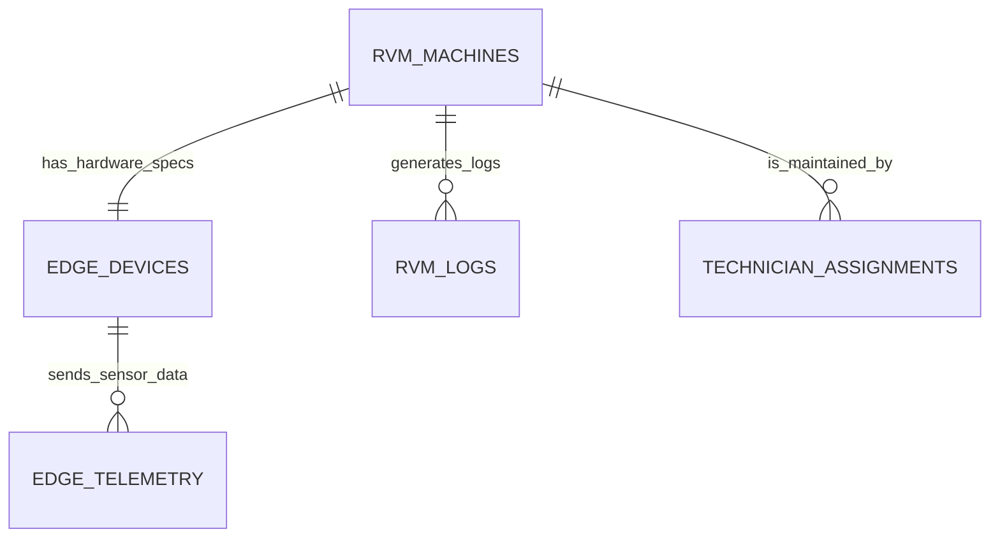
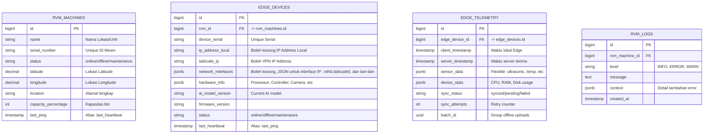
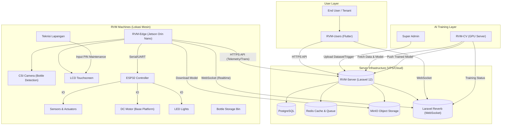

Rekapitulasi mengenai skema database dan arsitektur proyek dalam bentuk diagram konseptual.

### 1. Hubungan Database: RVM Machines, Edge Devices, & Telemetry

Struktur data yang dinamis untuk sensor dan manajemen perangkat fisik, berikut adalah gambaran hubungan entitasnya.
Inti dari desain ini adalah penggunaan kolom tipe **JSONB** pada tabel telemetri untuk mengakomodasi fleksibilitas sensor tanpa perlu mengubah struktur tabel setiap kali ada sensor baru.

**Diagram Entity-Relationship (ERD Konseptual)**

*   **RVM_MACHINES:** Tabel utama yang menyimpan identitas logis dan status operasional mesin (box/housing).
*   **EDGE_DEVICES:** Tabel detail teknis perangkat keras yang terpasang pada mesin tersebut (Jetson Orin Nano, ESP32, konfigurasi pin). Relasinya 1:1.
*   **EDGE_TELEMETRY:** Tabel *Time-Series* untuk data sensor. Kolom `sensor_data` bertipe JSONB mendukung struktur dinamis. Dirancang untuk **offline-capable sync** dengan `sync_status` dan `batch_id`.
*   **Catatan Terminologi:** `last_ping` (istilah user) = `last_heartbeat` (istilah programming) - keduanya merujuk pada timestamp terakhir device mengirim sinyal.

---

### 2. Arsitektur Proyek MyRVM Ecosystem

Anda benar, ada 4 pilar utama dalam arsitektur proyek ini. Yang keempat adalah **RVM-Edge**.

Berikut adalah komponen lengkapnya:
1.  **RVM-Server:** Backend pusat (Laravel + PostgreSQL).
2.  **RVM-Users:** Aplikasi mobile untuk pengguna dan tenant (Flutter).
3.  **RVM-CV:** Unit komputasi GPU untuk training & validasi (Python/PyTorch).
4.  **RVM-Edge:** Unit fisik mesin RVM (Jetson Orin Nano + ESP32).

**Diagram Arsitektur Sistem**

**Komponen Fisik RVM Machine:**
| Komponen | Status | Keterangan |
|----------|--------|------------|
| Jetson Orin Nano | WAJIB | Edge computing & AI inference |
| CSI Camera | WAJIB | Capture botol untuk deteksi |
| LCD Touch Screen | WAJIB | User interface |
| ESP32 Controller | WAJIB | Hardware I/O control |
| DC Motor | WAJIB | Buka/tutup alas botol |
| Ultrasonic Sensor | WAJIB | Deteksi level bin |
| Temperature Sensor | WAJIB | Monitor suhu internal |
| LED Lights | WAJIB | Indikator status |
| Bottle Storage Bin | WAJIB | Penampungan botol |
| *Future modules* | Opsional | Dapat ditambahkan di masa depan |

**Alur Data Utama:**
1.  **Transaksi:** Camera capture botol → Edge inference → Kirim hasil ke Server → Update saldo → Notifikasi User.
2.  **Telemetri:** Edge mengirim sensor data (JSON) setiap 30 detik. Offline mode: cache lokal, sync saat online.
3.  **AI Update:** Server simpan model baru → Edge deteksi hash baru → Download → Update lokal.
4.  **Maintenance:** Teknisi request akses → Server generate PIN → Input PIN di RVM → Masuk maintenance mode.

**Offline Mode:**
- Edge device cek koneksi dengan ping ke:
  1. `google.com` (internet availability)
  2. RVM-Server IP (server reachability)
- Jika offline: simpan data ke local storage
- Jika online: kirim batch dengan `batch_id` yang sama
- Server update `sync_status` menjadi `synced`
