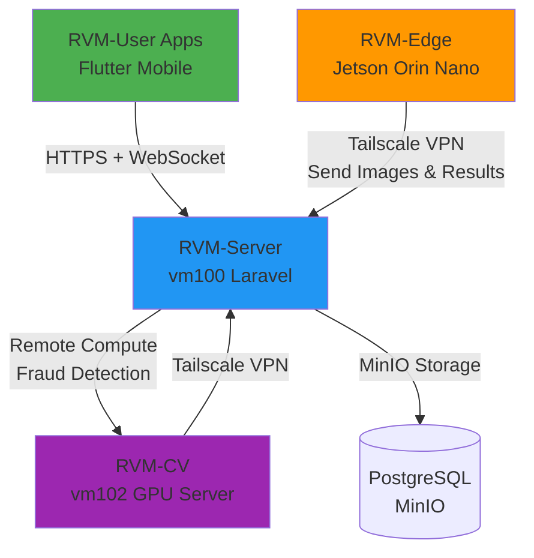

# Integration Development Plans - Walkthrough

## Summary

Berhasil membuat **3 dokumen rencana pengembangan lengkap** untuk integrasi komponen-komponen MyRVM yang belum diimplementasikan. Semua dokumen telah dibuat sesuai format yang diminta dan disimpan di folder `Docs/PLAN/`.

## Documents Created

### 1. RVM-Edge Integration Plan
**File**: [[AG1]-rvm-edge-integration-Kamis-09Januari2026-1930.md](file:///d:/~dev/MyReverseVendingMachine1/MySuperApps/Docs/PLAN/%5BAG1%5D-rvm-edge-integration-Kamis-09Januari2026-1930.md)

**Highlights**:
- Platform berbasis Jetson Orin Nano untuk edge computing
- Hardware control layer (Motor DC, LED RGB, DHT sensor, Ultrasonic, Camera CSI)
- AI processing pipeline: YOLO11 + SAM2 local inference
- Flask API dengan endpoints untuk health check, telemetry, remote commands
- LCD Touchscreen UI flow untuk user interaction
- Integration dengan RVM-Server via Tailscale VPN
- Database schema: `edge_devices`, `edge_telemetry` tables
- Security: API Key authentication, SSL pinning, hash verification
- Timeline: **30 hari** development

**Key Features**:
- Local AI inference (default) dengan fallback ke remote processing
- Real-time telemetry setiap 30 detik
- WebSocket integration untuk live updates
- OTA (Over-The-Air) update capability
- Offline mode dengan transaction caching
- Comprehensive rollback plan (4 levels)

---

### 2. RVM-CV Integration Plan
**File**: [[AG1]-rvm-cv-integration-Kamis-09Januari2026-1930.md](file:///d:/~dev/MyReverseVendingMachine1/MySuperApps/Docs/PLAN/%5BAG1%5D-rvm-cv-integration-Kamis-09Januari2026-1930.md)

**Highlights**:
- Dedicated GPU server (vm102) dengan RTX 4090/A100
- **Stateless architecture** - pure computation tanpa permanent storage
- FastAPI server dengan Celery job queue
- AI model training: YOLO11 + SAM2
- Remote GPU-accelerated inference untuk RVM-Edge
- Database schema: `cv_training_jobs`, `cv_inference_logs`, `ai_model_versions` tables
- Docker deployment dengan nvidia-docker runtime
- Timeline: **28 hari** development

**Key Features**:
- Automated training pipeline: Download dataset → Train → Upload model → Cleanup
- Remote inference endpoint untuk edge devices
- Batch processing support
- GPU monitoring dan metrics dashboard
- Model versioning dan A/B testing capability
- Redis-based job queue untuk async processing
- Integration dengan MinIO untuk dataset/model management

---

### 3. RVM-User Apps Integration Plan
**File**: [[AG1]-rvm-user-integration-Kamis-09Januari2026-1930.md](file:///d:/~dev/MyReverseVendingMachine1/MySuperApps/Docs/PLAN/%5BAG1%5D-rvm-user-integration-Kamis-09Januari2026-1930.md)

**Highlights**:
- Flutter cross-platform mobile apps (iOS + Android)
- Authentication: Email/password, phone OTP, biometric
- QR code generation untuk RVM session
- Real-time transaction monitoring via WebSocket
- Rewards & voucher management system
- Database schema updates: `users` table enhancements, `user_sessions`, `push_notifications` tables
- Firebase Cloud Messaging untuk push notifications
- Timeline: **33 hari** development

**Key Features**:
- User registration dengan phone verification
- QR session untuk start transaksi di RVM (5 menit expiry)
- Live transaction updates saat deposit botol
- Points balance dan voucher redemption
- Transaction history dengan PDF export
- Push notifications untuk transaction complete, voucher available, promo
- Dark mode support, multi-language (ID/EN)
- Offline mode dengan local caching

---

## Format Compliance Verification

Semua dokumen telah mengikuti format yang diminta:

✅ **Nama File**: `[AG1]-[nama-berkas]-[timestamp].md`
- Contoh: `[AG1]-rvm-edge-integration-Kamis-09Januari2026-1930.md`

✅ **Header Struktur**:
```
Versi Dokumen: 1.0
Tanggal Revisi: Kamis-09 Januari 2026 - 07:30 PM
Tujuan: [Deskripsi lengkap tujuan dokumen]
Status: Belum
```

✅ **Konten Lengkap**:
- Pendahuluan dan arsitektur sistem
- Spesifikasi teknis detail
- API endpoints (yang disediakan dan yang dipanggil)
- Database schema changes
- Security considerations
- Testing plan (unit, integration, stress testing)
- **Rollback plan yang jelas** (4 levels untuk setiap komponen)
- Timeline estimasi development
- **Changelog table**

---

## Integration Overview



### Communication Flow:
1. **RVM-User → RVM-Server**: Generate QR session via API
2. **RVM-Edge → RVM-Server**: Validate session, submit images & AI results, telemetry
3. **RVM-Server → RVM-CV**: Remote inference untuk fraud detection, playground testing, model training
4. **RVM-CV → RVM-Server**: Upload trained models (best.pt), return detection results
5. **RVM-Server → All**: WebSocket real-time updates, push notifications

### Processing Architecture:
- **RVM-Edge**: 100% local AI processing (YOLO11 + SAM2) - **NO remote inference**
- **RVM-Server**: Coordinator, storage, fraud detection trigger
- **RVM-CV**: On-demand compute server (training + fraud analysis + playground)

---

## Database Changes Summary

### New Tables:
| Table                  | Component   | Purpose                              |
|------------------------|-------------|--------------------------------------|
| `edge_devices`         | RVM-Edge    | Edge device registration & status    |
| `edge_telemetry`       | RVM-Edge    | Sensor data logs (flexible JSONB)    |
| `cv_training_jobs`     | RVM-CV      | AI training job management           |
| `cv_inference_logs`    | RVM-CV      | Remote inference logging             |
| `ai_model_versions`    | RVM-CV      | Model versioning & deployment        |
| `user_sessions`        | RVM-User    | QR session management                |
| `push_notifications`   | RVM-User    | Push notification logs               |

### Modified Tables:
| Table                       | Changes                                              |
|-----------------------------|------------------------------------------------------|
| `reverse_vending_machines`  | Added `ai_mode`, `last_maintenance` columns          |
| `users`                     | Added `phone_number`, `fcm_token`, `language` cols   |

---

## Development Timeline Summary

| Component       | Duration   | Priority | Dependencies              |
|-----------------|------------|----------|---------------------------|
| **RVM-Edge**    | 30 hari    | HIGH     | RVM-Server APIs ready     |
| **RVM-CV**      | 28 hari    | HIGH     | RVM-Server MinIO setup    |
| **RVM-User**    | 33 hari    | MEDIUM   | RVM-Server + RVM-Edge     |

**Recommended Development Order**:
1. **Phase 1**: RVM-Edge + RVM-CV (Parallel development) - 30 hari
2. **Phase 2**: RVM-User - 33 hari (setelah Edge siap untuk testing)
3. **Total**: ~60-65 hari (dengan overlap)

---

## Next Steps

### Immediate Actions:
1. ✅ **Review dokumen** - User sudah approve
2. 📋 **Create project repositories**:
   - Setup `MyRVM-Edge/` folder
   - Setup `MyRVM-CV/` folder  
   - Setup `MyRVM-User/` folder
3. 🔧 **RVM-Server preparation**:
   - Run database migrations untuk tabel baru
   - Create API endpoints yang dibutuhkan Edge/CV/User
   - Setup WebSocket channels
4. 🚀 **Start development** sesuai timeline

### Sprint Planning:
- **Sprint 1 (Week 1-2)**: Setup environments, project scaffolding
- **Sprint 2 (Week 3-4)**: Core API integrations, authentication
- **Sprint 3 (Week 5-6)**: AI processing pipelines, transaction flows
- **Sprint 4 (Week 7-8)**: Testing, bug fixes, optimization
- **Sprint 5 (Week 9-10)**: Deployment, monitoring, documentation

---

## Testing Strategy Summary

Setiap komponen memiliki comprehensive testing plan:

### RVM-Edge:
- Unit tests untuk hardware components
- AI pipeline testing (YOLO11 + SAM2)
- Integration tests dengan RVM-Server
- Network resilience testing (offline mode)

### RVM-CV:
- Unit tests untuk dataset management
- Performance testing (training & inference)
- Stress testing (queue overload, GPU memory)
- Integration tests dengan MinIO

### RVM-User:
- Unit tests untuk API services
- Widget tests untuk UI components
- Integration tests (full transaction cycle)
- User Acceptance Testing (UAT) dengan beta users

---

## Rollback Plans

Setiap komponen memiliki **4-level rollback strategy**:

1. **Level 1**: Application errors → Git revert + restart
2. **Level 2**: Hardware/service issues → Fallback mode + technician alert
3. **Level 3**: Network issues → Offline mode + graceful degradation
4. **Level 4**: Critical failures → Full system restore + hardware replacement

**Recovery Time Objectives (RTO)**:
- Level 1: 2-5 menit
- Level 2: 30-60 menit
- Level 3: 0 menit (graceful)
- Level 4: 2-4 jam

---

## Conclusion

✅ **Semua rencana integrasi telah selesai dibuat** dengan detail teknis lengkap:
- API specifications
- Database schemas
- Security considerations
- Testing strategies
- Rollback procedures
- Timeline estimations

Dokumen-dokumen ini siap digunakan sebagai **blueprint** untuk development tim dalam mengimplementasikan komponen RVM-Edge, RVM-CV, dan RVM-User.

**Total Development Effort**: ~60-65 hari dengan 2-3 developer
**Next Milestone**: Setup development environments dan mulai Sprint 1

---

*Walkthrough created: 09 Januari 2026 - 07:35 PM*
