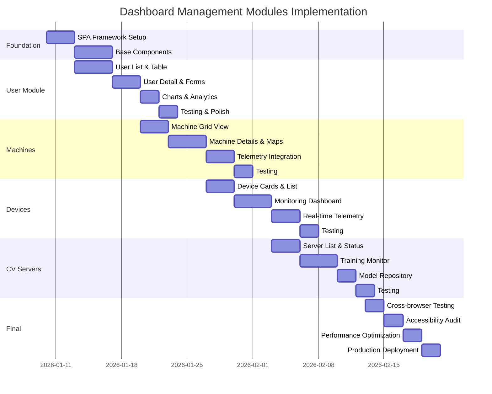

# [AG1] Dashboard Management - Implementation Roadmap

**Versi Dokumen**: 1.0  
**Tanggal Revisi**: Jumat-10 Januari 2026 - 02:47 PM  
**Tujuan**: Quick reference roadmap untuk implementasi dashboard management modules  
**Status**: Belum

---

## 🎯 OVERVIEW

Roadmap ini adalah ringkasan visual dari development plan lengkap untuk 4 Management Modules:
1. User & Tenants
2. RVM Machines  
3. Edge Devices
4. CV Servers

---

## 📅 6-WEEK TIMELINE



---

## 📋 WEEKLY MILESTONES

### Week 1: Foundation + User Module Start
**10-17 Januari 2026**

✅ **Deliverables**:
- SPA navigation framework working
- Skeleton loaders implemented
- User list table functional
- Search & filter working
- API endpoints ready

📊 **Progress KPIs**:
- SPA navigation: 100%
- User module: 50%

---

### Week 2: User Module Complete + Machines Start
**17-24 Januari 2026**

✅ **Deliverables**:
- User management fully functional
- User detail modal with charts
- Create/Edit user forms
- Machine grid view started
- Map integration setup

📊 **Progress KPIs**:
- User module: 100%
- Machines module: 30%

---

### Week 3: Machines Complete + Devices Start
**24-31 Januari 2026**

✅ **Deliverables**:
- Machine management complete
- Telemetry visualization
- Device list started
- Device monitoring setup

📊 **Progress KPIs**:
- Machines module: 100%
- Devices module: 40%

---

### Week 4: Devices Complete + CV Start
**31 Januari - 7 Februari 2026**

✅ **Deliverables**:
- Edge Devices module complete
- Real-time monitoring working
- CV Servers list started
- Training monitor setup

📊 **Progress KPIs**:
- Devices module: 100%
- CV Servers module: 40%

---

### Week 5: CV Complete + Testing
**7-14 Februari 2026**

✅ **Deliverables**:
- CV Servers module complete
- All modules tested
- Integration testing done
- Bug fixes completed

📊 **Progress KPIs**:
- CV Servers module: 100%
- Testing: 80%

---

### Week 6: Production Ready
**14-21 Februari 2026**

✅ **Deliverables**:
- Cross-browser testing complete
- Accessibility verified
- Performance optimized
- Documentation finalized
- PRODUCTION DEPLOYED

📊 **Progress KPIs**:
- Testing: 100%
- Documentation: 100%
- Deployment: 100%

---

## 🏗️ ARCHITECTURE LAYERS

```
┌─────────────────────────────────────────────┐
│          PRESENTATION LAYER                 │
│  ┌───────────┐ ┌───────────┐ ┌───────────┐ │
│  │  Blade    │ │   CSS     │ │JavaScript │ │
│  │ Templates │ │ Bootstrap │ │   SPA     │ │
│  └───────────┘ └───────────┘ └───────────┘ │
└─────────────────┬───────────────────────────┘
                  │
┌─────────────────┴───────────────────────────┐
│           APPLICATION LAYER                 │
│  ┌───────────┐ ┌───────────┐ ┌───────────┐ │
│  │Controllers│ │ Middleware│ │ Validation│ │
│  │  (MVC)    │ │   (Auth)  │ │  (Forms)  │ │
│  └───────────┘ └───────────┘ └───────────┘ │
└─────────────────┬───────────────────────────┘
                  │
┌─────────────────┴───────────────────────────┐
│             DATA LAYER                      │
│  ┌───────────┐ ┌───────────┐ ┌───────────┐ │
│  │  Models   │ │   API     │ │ Database  │ │
│  │ Eloquent  │ │ RESTful   │ │PostgreSQL │ │
│  └───────────┘ └───────────┘ └───────────┘ │
└─────────────────────────────────────────────┘
```

---

## 📦 MODULE DEPENDENCIES

```
User & Tenants Module
├── APIs: /api/v1/admin/users/*
├── Models: User
├── Views: dashboard/users/*
└── JS: modules/users.js

RVM Machines Module
├── APIs: /api/v1/rvm-machines/*
├── Models: RvmMachine, TelemetryData
├── Views: dashboard/machines/*
├── JS: modules/machines.js
└── External: Leaflet.js (Maps)

Edge Devices Module
├── APIs: /api/v1/edge/devices/*
├── Models: EdgeDevice
├── Views: dashboard/devices/*
├── JS: modules/devices.js
└── Charts: ApexCharts (Real-time)

CV Servers Module
├── APIs: /api/v1/cv/*
├── Models: AiModelVersion
├── Views: dashboard/cv-servers/*
└── JS: modules/cv-servers.js
```

---

## 🛠️ TECHNOLOGY STACK

### Frontend
- **Templates**: Blade + HTML5
- **Styling**: Bootstrap 5 + Custom CSS
- **JavaScript**: Vanilla JS (ES6+) + Fetch API
- **Charts**: ApexCharts
- **Maps**: Leaflet.js
- **Icons**: Tabler Icons

### Backend
- **Framework**: Laravel 12
- **Database**: PostgreSQL
- **API**: RESTful JSON
- **Auth**: Laravel Sanctum
- **Caching**: Redis (optional)

### DevOps
- **Version Control**: Git
- **CI/CD**: GitHub Actions
- **Testing**: PHPUnit, Jest, Cypress
- **Monitoring**: Sentry, Google Analytics

---

## ✅ DEFINITION OF DONE

### Per Module
- ✅ All features implemented per specs
- ✅ Unit tests written (>80% coverage)
- ✅ Integration tests passing
- ✅ Responsive on all breakpoints
- ✅ Accessibility verified (WCAG 2.1 AA)
- ✅ Cross-browser tested
- ✅ Performance optimized (Lighthouse >90)
- ✅ Documentation complete
- ✅ Code reviewed & merged

### Overall Project
- ✅ All 4 modules complete
- ✅ SPA navigation seamless
- ✅ No critical bugs
- ✅ User acceptance testing passed
- ✅ Production deployment successful
- ✅ User manual published
- ✅ Admin guide available

---

## 🎯 SUCCESS METRICS

### Technical Metrics
| Metric | Target | Measurement |
|--------|--------|-------------|
| Page Load Time | <2s | Lighthouse |
| Time to Interactive | <3s | Lighthouse |
| Performance Score | >90 | Lighthouse |
| Accessibility Score | 100 | axe-core |
| Code Coverage | >80% | Jest + PHPUnit |
| Bug Density | <5 bugs/KLOC | SonarQube |

### User Experience Metrics
| Metric | Target | Measurement |
|--------|--------|-------------|
| User Satisfaction | >4.5/5 | Survey |
| Task Completion Rate | >95% | Analytics |
| Error Rate | <2% | Error Tracking |
| Mobile Usage | >30% | Analytics |

---

## 🚨 RISK MANAGEMENT

### High Risk Items
| Risk | Impact | Mitigation |
|------|--------|------------|
| API delays | High | Mock data for development |
| Browser compatibility | Medium | Early testing, polyfills |
| Performance issues | High | Lazy loading, optimization |
| Security vulnerabilities | Critical | Security audit, pen testing |

### Contingency Plans
1. **API not ready**: Use mock data, implement later
2. **Performance issues**: Implement pagination, caching
3. **Browser bugs**: Add polyfills, fallbacks
4. **Timeline slippage**: Prioritize critical features

---

## 📞 COMMUNICATION PLAN

### Daily
- Stand-up meeting (15 min)
- Slack updates on blockers

### Weekly
- Progress report email (Friday)
- Demo session (bi-weekly)
- Retrospective meeting

### Ad-hoc
- Blocker escalation (immediate)
- Design review (as needed)
- Code review (per PR)

---

## 🏁 NEXT STEPS

### Immediate (Today)
1. ✅ Review & approve development plan
2. ✅ Create feature branch
3. ✅ Setup development environment

### Week 1 (10-17 Jan)
1. ⏳ Implement SPA framework
2. ⏳ Create base components
3. ⏳ Start User module development

### Week 2 (17-24 Jan)
1. ⏳ Complete User module
2. ⏳ Start Machines module
3. ⏳ Integrate maps

---

**Status**: 🟡 **Planning Complete - Ready to Start**

**Last Updated**: 10 Januari 2026 14:45 WIB  
**Next Review**: 17 Januari 2026

---

**End of Roadmap**
